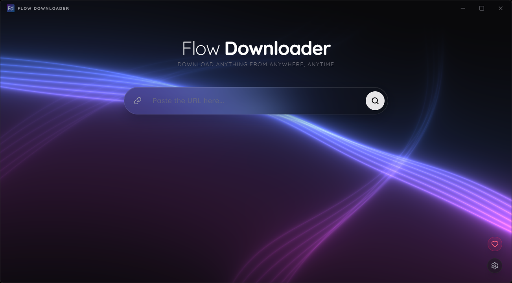
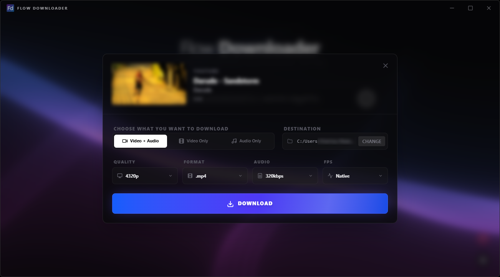

# 🌊 Flow Downloader

**Flow Downloader** is a modern, high-speed, and multilingual desktop application designed for high-fidelity media downloads. Built with **Tauri v2** and **React**, it offers a lightweight yet powerful experience for grabbing content from across the web.

  

  

## 🌟 How to Use (Simple Install)

You don't need any technical knowledge to use Flow Downloader. Everything required is bundled inside the installer.

1.  **Download**: Visit the **[Latest Releases](https://github.com/stanley-meloo/Flow-Downloader/releases/latest)** page.
2.  **Install**: Download and run the `.exe` installer (e.g., `Flow-Downloader_1.0.0_x64-setup.exe`).
3.  **Run**: Open the app, paste your link, and choose your preferred quality.

## ✨ Features & Capabilities

### 📥 Versatile Download Modes
Control exactly what you download with specialized modes:
* **Video + Audio**: Get the best of both worlds in up to **8K Ultra HD** with perfectly synced sound.
* **Video Only**: Perfect for editors needing raw 4K/8K footage without the audio track.
* **Audio Only**: High-fidelity extraction for music and podcasts, optimized for compatibility.
* **Thumbnails**: Automatically extract and view high-resolution video cover art.

### 🍱 Smart Playlist Support
Save time by downloading entire collections at once.
* **Auto-Detection**: Paste a playlist link, and the app will intelligently index every valid video.
* **Queue Management**: Process up to 3 concurrent downloads with real-time progress tracking.

### 🌍 Global Compatibility & Localization
Flow Downloader is compatible with hundreds of video platforms and social networks.
👉 **[Check all 1000+ supported sites here](https://github.com/yt-dlp/yt-dlp/blob/master/supportedsites.md)**

#### **Supported Languages (16)**
The interface is fully localized in:
1.  **English**
2.  **Português (Brasil)**
3.  **Español**
4.  **Français**
5.  **Deutsch**
6.  **Italiano**
7.  **Русский (Russian)**
8.  **Türkçe (Turkish)**
9.  **Tiếng Việt (Vietnamese)**
10. **简体中文 (Chinese Simplified)**
11. **日本語 (Japanese)**
12. **한국어 (Korean)**
13. **Hindi**
14. **Bengali**
15. **Arabic**
16. **Polish**
---

## ❤️ Support the Creator

If this tool helps your workflow, consider supporting its development. Every contribution helps me keep the project updated and free.

* **[Linktree](https://linktr.ee/flow.downloader)**: Explore all support options and follow my work.

---

## 🛠️ Technical Overview (For Developers)

Built for performance and security, leveraging the best of the Rust and JavaScript ecosystems.

### Tech Stack
* **Frontend**: React + Vite + Tailwind CSS with a modern Glassmorphism UI.
* **Backend**: Rust (Tauri v2) for native speed and safe system calls.
* **Optimization**: Custom logic to bypass 1080p limits and handle 8K (VP9/AV1) codecs.
* **Audio Engine**: Automatic remuxing to AAC/M4A for guaranteed playback on all devices.

### Building from Source
1.  **Clone**: `git clone https://github.com/stanley-meloo/Flow-Downloader.git`
2.  **Dependencies**: `npm install`
3.  **Sidecars**: Place `ffmpeg` and `ytdlp` in `src-tauri/binaries/` using the correct target triple (e.g., `ytdlp-x86_64-pc-windows-msvc.exe`).
4.  **Launch**: `npm run tauri dev`
5.  **Build**: `npm run tauri build`

## 📄 License
This project is licensed under the **MIT License** - see the [LICENSE](LICENSE) file for details.

---

## ⚖️ Legal Disclaimer

**Flow Downloader** is a tool designed for **educational purposes and personal archiving only**. By using this software, you agree to the following terms:

1.  **User Responsibility**: The user is solely responsible for the content they download. You must ensure that you have the legal right or explicit permission from the copyright holder before downloading any media.
2.  **Terms of Service**: This application interacts with third-party platforms (such as YouTube, TikTok, and others). Using this tool may violate their respective Terms of Service. The developer of Flow Downloader is not responsible for any account bans or IP restrictions resulting from the use of this software.
3.  **No Commercial Use**: This software is provided for free and is not intended for commercial exploitation. Any donation made via PayPal or Linktree is a voluntary contribution toward the development of the software and does not constitute a purchase of content.
4.  **Third-Party Engines**: Flow Downloader utilizes `yt-dlp` and `ffmpeg` as backend engines. These tools are governed by their own licenses and the developer does not claim ownership over their respective technologies.
5.  **No Warranty**: This software is provided "as is" without any warranty of any kind, express or implied. The developer will not be held liable for any damages, data loss, or legal consequences arising from the use of this application.

---
*Developed by Stanley Melo*
